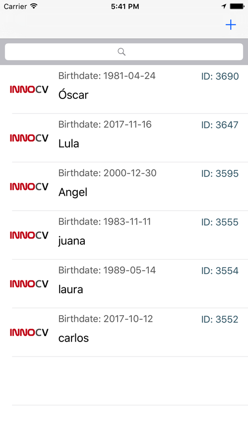
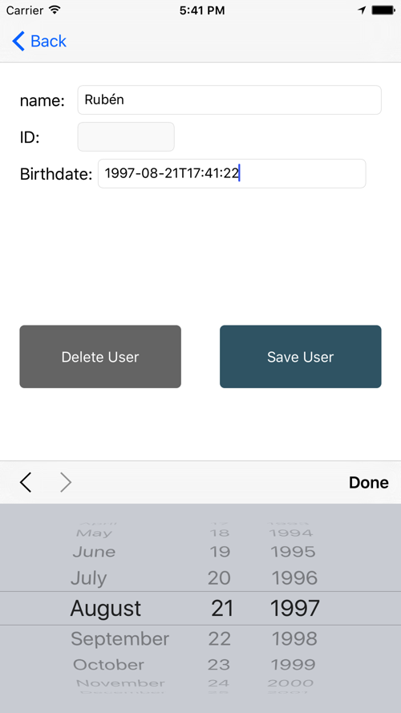
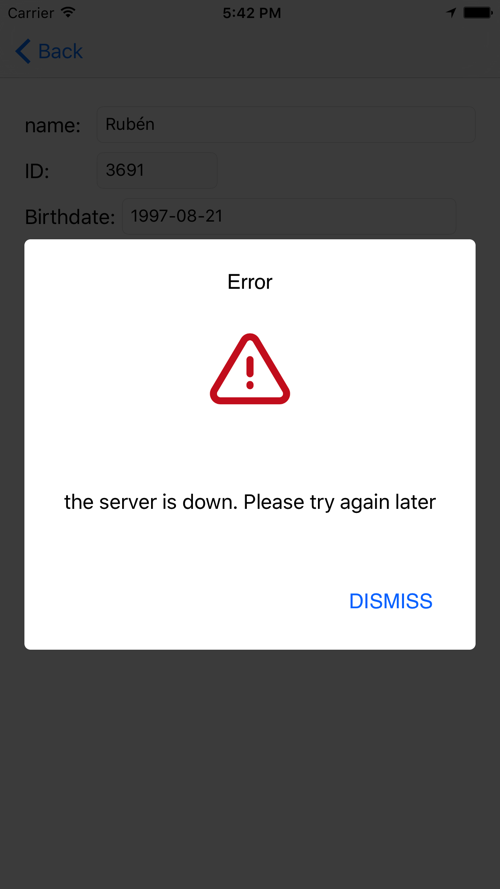

# innoCV #

Proyecto a modo de prueba técnica para la empresa **innoCV**. 

Es un sencillo listview que descarga los usuarios de una API de los chicos de innoCV para testear un CRUD de forma simple. Al hacer click sobre algún usuario, te lo muestra en detalle. Utilizo `Core Data` a modo de persistencia de datos y caché, para poder ver los usuarios en modo offline. He utilizado en esta ocasión el lenguaje `Swift`.

Para más información, visita mi blog: [www.oscargarrucho.com](http://oskarko.github.io/)